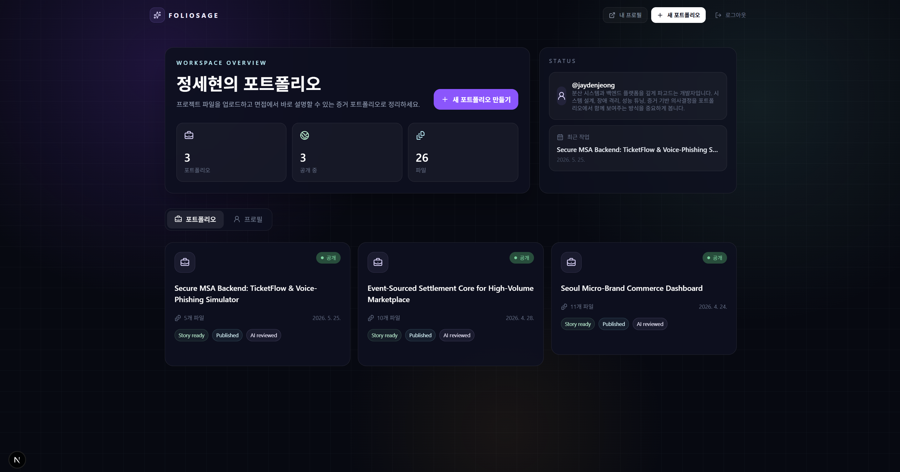
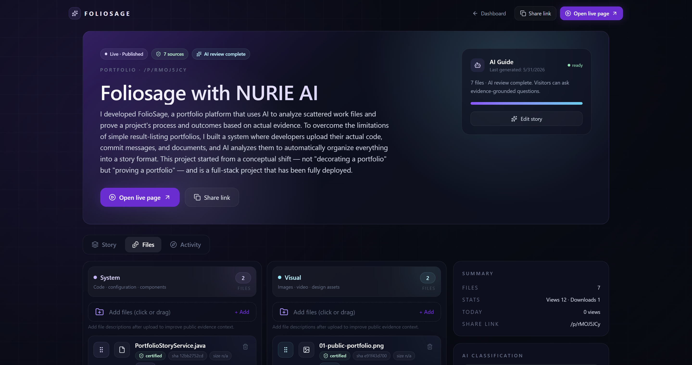
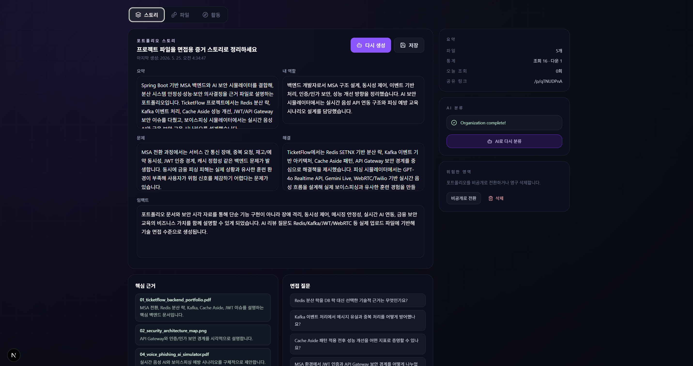
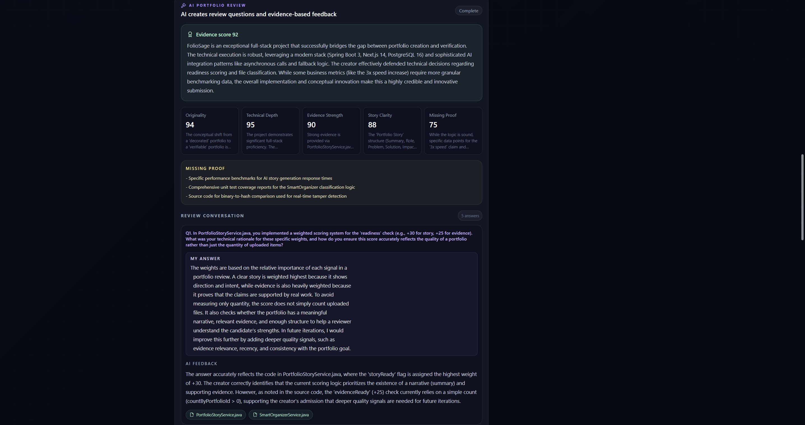
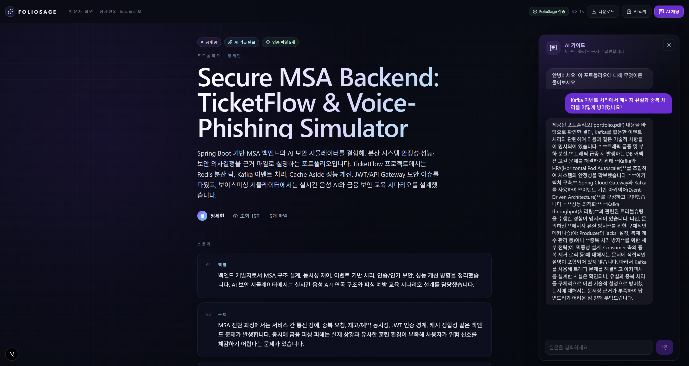
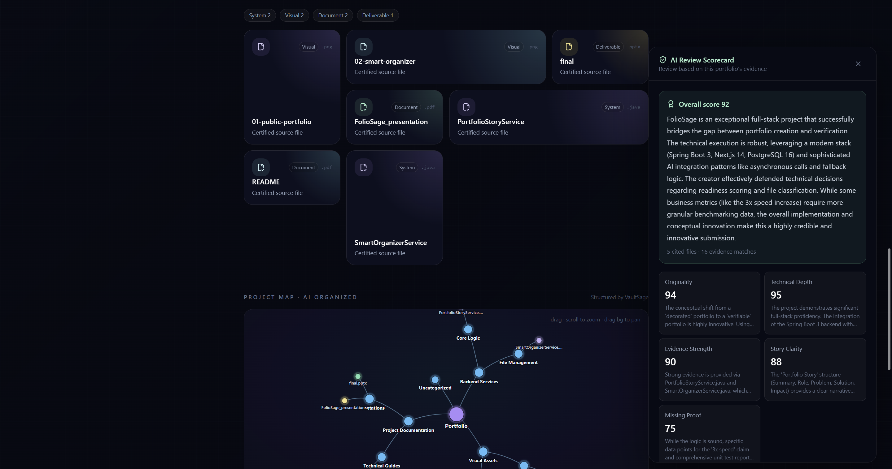

# FolioSage

[English](#english) | [한국어](#korean)

[](https://openjdk.org/)
[](https://spring.io/projects/spring-boot)
[](https://nextjs.org/)
[](https://www.postgresql.org/)
[](https://vaultsage.ai/)

<a id="english"></a>


## English

[English](#english) | [한국어](#korean)

> An AI portfolio platform that organizes, explains, and proves creative work with real evidence.

FolioSage is a submission for **Visionary AI: NURIE.AI 2026 Cross-Platform Innovation Awards**.

Live Demo: **https://foliosage.cloud**

Live Page Sample : **https://www.foliosage.cloud/p/7WwwkQRJ**

### Submission Overview

FolioSage turns scattered project files into an evidence-backed portfolio. A creator can upload proposals, presentation decks, PDFs, images, code files, and process artifacts. The system organizes those files, generates an interview-ready story, reviews the creator's answers with AI, and publishes a public portfolio where visitors can ask questions grounded in the uploaded files.

| Item | Description |
| --- | --- |
| Competition | NURIE.AI Visionary AI 2026 Cross-Platform Innovation Awards |
| Live demo | https://foliosage.cloud |
| Category | Web browser application with REST APIs and public share links |
| Target users | Job seekers, designers, developers, creators, portfolio reviewers |
| Core value | AI-generated portfolio content backed by real source-file evidence |
| External AI layer | VaultSage Files, Share, and Public Chat APIs |

### Why It Matters

Most portfolio sites show polished outputs but do not prove how the work was made. Reviewers still need to ask who contributed, which files prove the process, whether the creator can explain trade-offs, and whether visitors can inspect the work without opening every file manually.

FolioSage connects portfolio storytelling, AI review, public Q&A, file hashes, timestamps, and certificates into one workflow.

### Product Walkthrough

**Dashboard** — Creator workspace overview with portfolio count, published status, and uploaded file count. Each card shows story, evidence, and review readiness at a glance.



---

**Smart Organizer** — Files are organized into four evidence lanes (System, Visual, Document, Deliverable). AI reclassifies files automatically; manual lock preserves creator intent.



---

**AI Folder Structure** — The VaultSage Smart Organizer pipeline generates a project folder tree, materializes it, and displays the result as an interactive force graph in both the editor and the public portfolio page.

Screenshot slot: `docs/screenshots/07-ai-folder-structure.png`

---

**Portfolio Story** — AI generates a structured story (Summary, Role, Problem, Solution, Impact) with Evidence Highlights linked to concrete uploaded files and predicted Interview Questions.



---

**AI Portfolio Review** — AI scores creator answers across five dimensions and returns cited evidence, missing proof alerts, and targeted improvement feedback.



---

**Public Portfolio** — Visitors read the full portfolio story and chat with the AI guide, which answers questions grounded in the uploaded evidence files.



---

**Public Portfolio — Evidence & AI Chat** — Visitors browse the evidence file grid, view AI review scores, and ask the AI guide questions answered from the shared files — no login required.



---

**Public Creator Profile** — A creator profile at `/u/{username}` collects the creator bio, public stats, public portfolio cards, AI review badges, and share/copy actions in one public landing page.

Screenshot slot: `docs/screenshots/06-public-profile.png`

### Judge Demo Path

Start from the deployed service:

- App: https://foliosage.cloud
- Public portfolio format: `https://foliosage.cloud/p/{shareCode}`

If evaluation time is short, these five scenes show the core innovation:

1. **Upload evidence files**: Manage planning documents, slides, source code, images, PDFs, ZIP files, and final outputs together.
2. **Generate an AI portfolio story**: Create Summary, Role, Problem, Solution, Impact, Evidence Highlights, and Interview Questions from uploaded files.
3. **Run AI Portfolio Review**: Generate defense questions, answer them, and inspect feedback, scorecards, missing proof, and cited files.
4. **Inspect the AI folder graph**: Show how VaultSage grouped files into a project map, separate from the editable four-lane evidence categories.
5. **Publish a public link**: Share the portfolio through `/p/{shareCode}` and optionally the creator profile through `/u/{username}`.
6. **Ask the visitor AI guide**: Visitors can ask questions and receive answers grounded in the shared evidence files.

### Full Demo Scenario

| Step | Screen | What to show | Key point |
| --- | --- | --- | --- |
| 1 | Login / Dashboard | Portfolio count, published count, uploaded file count | A service for turning scattered work files into evidence-backed portfolios |
| 2 | New Portfolio | Title and description input | The portfolio starts from a project context, not just a gallery page |
| 3 | File Upload | Upload plans, decks, images, PDFs, code, ZIPs | Each file is tracked as evidence with metadata and hash |
| 4 | Evidence Organization | Place files into System, Visual, Document, and Deliverable lanes manually or with AI reclassification | The file board stays editable: upload into a lane, drag between lanes, or ask AI to reorganize |
| 5 | Portfolio Story | Generate summary, role, problem, solution, impact | Evidence Highlights and Interview Questions are generated together |
| 6 | Story Editing | Edit and save the AI draft | AI drafts stay under creator control |
| 7 | Readiness | Check Story, Evidence, AI Review, Public Link status | The product shows whether the portfolio is ready to publish |
| 8 | AI Portfolio Review | Questions, answers, feedback, scorecard | Reviews are grounded in uploaded evidence, not generic chat |
| 9 | AI Folder Structure | Open the interactive folder graph generated by VaultSage | The product shows both creator-controlled categories and VaultSage's generated folder organization |
| 10 | Publish | Generate and copy public link | Visitors can inspect the portfolio without logging in |
| 11 | Public Page | Story, evidence grid, project map, preview/download | Judges see the result, proof files, and AI-generated structure in one place |
| 12 | Public Profile | Open `/u/{username}` | Multiple public portfolios and AI review badges are collected under one creator page |
| 13 | Visitor AI Chat | Ask about role, evidence, improvements | AI answers from public file context and cites evidence |
| 14 | Public Review Summary | Overall score, categories, cited files | Review results can be shared with visitors |
| 15 | Stats / Certificate | Views, downloads, file certificate | Shared work has trust and traceability signals |

Example visitor AI questions:

- What was the creator's role in this project?
- Which files best prove the planning and final result?
- What should be improved from a judge's perspective?

### Core Features

| Feature | What It Does | Evidence / AI Value |
| --- | --- | --- |
| Multi-file evidence upload | Upload PDFs, images, decks, code files, ZIPs, and process artifacts | Stores file metadata, SHA-256 hash, timestamp, and VaultSage file id |
| Evidence file organization | Four-lane file board for System, Visual, Document, and Deliverable evidence, with lane upload, drag-and-drop movement, manual locking, and AI reclassification | Makes scattered files easier to inspect, explain, and publish without hiding user control |
| AI folder structure graph | Runs the VaultSage organizer pipeline, fetches generated folders and assigned file IDs, and renders them as an interactive D3 force graph | Shows how the evidence corpus is grouped beyond the local four-category summary |
| Portfolio Story generation | Generates summary, role, problem, solution, impact | Turns uploaded evidence into interview-ready copy |
| Evidence Highlights | Links generated claims to concrete uploaded files | Helps reviewers inspect the proof behind the story |
| Interview Questions | Creates likely defense questions from the portfolio context | Helps creators prepare for interviews and judging |
| AI Portfolio Review | Scores creator answers and returns feedback, missing proof, cited files | Reviews are grounded in actual portfolio files |
| Public portfolio page | Publishes `/p/{shareCode}` for visitors | Judges can inspect story, file grid, project map, preview, and download |
| Public creator profile | Publishes `/u/{username}` for a creator's public portfolio collection | Visitors can browse public portfolios, stats, and AI review badges from one shareable profile |
| Visitor AI chat | Lets visitors ask questions about the portfolio | AI answers from the public file context |
| Certificate / stats | Provides file certificates and view/download statistics | Supports trust, ownership, and post-share tracking |

### VaultSage Integration

FolioSage uses VaultSage as a trust and AI layer for portfolio evidence.

| VaultSage capability | FolioSage usage |
| --- | --- |
| Files API | Upload, preview, and download original work files |
| Smart Organizer + local organizer | Run VaultSage folder generation/materialization, then store category, confidence, reasoning, and manual-lock state for each evidence file |
| Share API | Create controlled public access for portfolio evidence |
| Public Chat API | Answer visitor questions from shared portfolio files |

| VaultSage API endpoint | Used in FolioSage for | Backend entry point |
| --- | --- | --- |
| `POST /api/v1/directories/` | Create one evidence workspace per portfolio | `PortfolioService.create()` |
| `POST /api/v1/files/` | Upload portfolio evidence files and store the returned `vaultsageFileId` | `PortfolioService.uploadFile()` |
| `POST /api/v1/files/png-preview-reprocess/{id}` / `GET /api/v1/files/png-preview-download/{id}` | Generate and display file previews in the portfolio editor | `PortfolioService.uploadFile()`, `PortfolioController.preview()` |
| `POST /api/v1/smart-organizers/{id}/generate` / `apply` / `materialize` / `tree` / `nodes/{nodeId}/files` | Build and display VaultSage's generated project folder structure | `OrganizeService`, `VaultSageService.fetchOrganizerTree()` |
| `POST /api/v1/share/` | Create a public share code for published portfolio evidence | `PublishService.publish()` |
| `GET /api/v1/files/stream-preview-anonymous` / `GET /api/v1/files/png-preview-download-anonymous` / `POST /api/v1/files/download` | Let visitors preview PDF/images directly, render supported documents as PNG previews, or download public evidence files | `PublicController.preview()`, `PublicController.rawFile()` |
| `POST /api/v1/chat/public` | Power public AI chat and AI interview-style review questions from shared files | `PublicController.chat()`, `DefenseService` |
| `POST /api/v1/chat/message/v2` | Generate private portfolio story and readiness feedback using uploaded evidence context | `PortfolioStoryService` |

### Competition Fit

| Judging criterion | FolioSage focus |
| --- | --- |
| Technical Execution | Deployed Next.js + Spring Boot + PostgreSQL service with JWT/OAuth, upload, public links, stats, certificates, and AI review workflow |
| Creativity | Reframes a portfolio from a static showcase into an AI-questionable submission backed by evidence |
| Business Potential | Applicable to job search, freelance sales, design/development portfolio verification, and project evaluation in education |

### Architecture

```text
Creator / Visitor
       |
       v
Next.js 16 Frontend
  - dashboard
  - portfolio editor
  - public portfolio page
  - public profile page
       |
       v
Spring Boot 3.4 Backend
  - JWT / Google OAuth
  - portfolio API
  - publish API
  - defense review API
  - certificate generation
       |
       +--> PostgreSQL 16
       |      users, portfolios, files, stories, defense sessions
       |
       +--> VaultSage API
              files, shares, public chat
```

### Test Instructions for Judges

FolioSage is already deployed, so judges do not need to run the project locally for product evaluation.

1. Open https://foliosage.cloud.
2. Sign up or log in.
3. Create a portfolio with a title and short description.
4. Upload sample project files such as a PDF, image, presentation deck, source code file, or ZIP.
5. Organize files in the four-lane evidence board. Upload directly into a lane, drag files between lanes, or run AI reclassification.
6. Generate the Portfolio Story and review the generated Summary, Role, Problem, Solution, Impact, Evidence Highlights, and Interview Questions.
7. Run AI Portfolio Review, answer the generated questions, and inspect the feedback, scorecard, missing proof, and cited files.
8. Inspect the AI folder structure graph once organization completes.
9. Publish the portfolio and open `https://foliosage.cloud/p/{shareCode}`.
10. On the public page, preview/download files, inspect the project map, and ask the visitor AI guide questions grounded in the uploaded evidence.
11. Open `https://foliosage.cloud/u/{username}` to see the creator's public profile and portfolio cards.
12. Return to the admin screen and check view/download statistics and file certificate download.

### Tech Stack

| Area | Technology |
| --- | --- |
| Frontend | Next.js 16.2.4, React 19, TypeScript, Tailwind CSS 4, shadcn/ui, Base UI, Zustand, Axios, lucide-react, d3-force |
| Backend | Java 21, Spring Boot 3.4.4, Spring Security, Spring Data JPA, WebFlux WebClient, Validation |
| Auth | JWT, Google OAuth2 |
| Database | PostgreSQL 16, Flyway |
| Document | Apache PDFBox |
| Infra | Docker, Docker Compose |
| External API | VaultSage API |

### Project Structure

```text
foliosage/
├── foliosage-backend/
│   ├── src/main/java/com/foliosage/
│   │   ├── config/          # Security, WebClient configuration
│   │   ├── controller/      # Auth, User, Portfolio, Public API
│   │   ├── dto/             # Request/response DTOs
│   │   ├── entity/          # JPA entities
│   │   ├── repository/      # Spring Data repositories
│   │   ├── security/        # JWT and OAuth2 handlers
│   │   └── service/         # Portfolio, VaultSage, certificate, defense logic
│   └── src/main/resources/
│       ├── application.yml
│       └── db/migration/    # Flyway migrations
├── foliosage-frontend/
│   ├── app/                 # Next.js App Router
│   ├── components/          # UI and portfolio components
│   └── lib/                 # API client and auth helpers
├── docs/
│   ├── screenshots/         # Screenshot slots for judging README
│   ├── submission/          # Competition submission draft
│   ├── vaultsage-openapi.json
│   └── superpowers/         # Design docs and implementation plans
├── docker-compose.yml
└── .env.docker.example
```

### Developer Notes

The deployed product at https://foliosage.cloud is the primary evaluation target. Local execution is supported for code review and reproducibility through Docker Compose using `.env.docker.example`, but it is not required for the judging flow above.

### API Summary

| Group | Main endpoints |
| --- | --- |
| Auth / User | `POST /api/auth/signup`, `POST /api/auth/login`, `GET /api/users/me`, `PATCH /api/users/me/profile` |
| Portfolio | `POST /api/portfolios`, `GET /api/portfolios`, `GET /api/portfolios/{id}`, `POST /api/portfolios/{id}/files`, `PATCH /api/portfolios/{id}/files/{fileId}/category`, `POST /api/portfolios/{id}/organize?force=true`, `POST /api/portfolios/{id}/story/generate`, `POST /api/portfolios/{id}/publish` |
| Defense Review | `POST /api/portfolios/{id}/defense/sessions`, `GET /api/portfolios/{id}/defense/sessions/latest`, `POST /api/portfolios/{id}/defense/sessions/{sessionId}/answers` |
| Public | `GET /api/public/{shareCode}`, `POST /api/public/{shareCode}/chat`, `GET /api/public/{shareCode}/defense`, `GET /api/public/{shareCode}/organize/tree`, `GET /api/public/{shareCode}/preview/{vaultsageFileId}`, `GET /api/public/users/{username}` |

### Verification

```bash
cd foliosage-backend
./gradlew test
```

```bash
cd foliosage-frontend
npm run build
```

<a id="korean"></a>

## 한국어

[English](#english) | [한국어](#korean)

> AI가 정리하고, 설명하고, 증명하는 포트폴리오 플랫폼

FolioSage는 **Visionary AI: NURIE.AI 2026 Cross-Platform Innovation Awards** 제출작입니다.

라이브 데모: **https://foliosage.cloud**

Live Page Sample : **https://www.foliosage.cloud/p/7WwwkQRJ**

### 제출작 개요

FolioSage는 취업 준비생, 디자이너, 개발자, 크리에이터가 흩어진 작업 파일을 업로드하면 AI가 포트폴리오 구조로 정리하고, 실제 파일 근거를 바탕으로 소개 글과 질의응답을 제공하는 증거 기반 포트폴리오 서비스입니다.

| 항목 | 설명 |
| --- | --- |
| 공모전 | NURIE.AI Visionary AI 2026 Cross-Platform Innovation Awards |
| 라이브 데모 | https://foliosage.cloud |
| 카테고리 | 웹 브라우저 앱, REST API, 공개 공유 링크 |
| 대상 사용자 | 취업 준비생, 디자이너, 개발자, 크리에이터, 포트폴리오 리뷰어 |
| 핵심 가치 | 실제 파일 증거에 기반한 AI 포트폴리오 콘텐츠 생성 |
| 외부 AI 계층 | VaultSage Files, Share, Public Chat API |

### 왜 필요한가

대부분의 포트폴리오 사이트는 완성된 결과물은 보여주지만, 그 작업이 어떻게 만들어졌는지는 증명하지 못합니다. 리뷰어는 작성자의 실제 기여도, 기획과 과정의 근거 파일, 의사결정과 보완점을 설명할 수 있는지, 방문자가 모든 파일을 직접 열지 않고도 질문할 수 있는지를 확인해야 합니다.

FolioSage는 포트폴리오 스토리텔링, AI 리뷰, 공개 Q&A, 파일 해시, 타임스탬프, 인증서를 하나의 흐름으로 연결합니다.

### 제품 화면

**대시보드** — 포트폴리오 수·공개 상태·파일 수를 한눈에 확인합니다. 각 카드에서 스토리·증거·리뷰 준비 상태를 표시합니다.


---

**AI 파일 정리 (Smart Organizer)** — 파일을 시스템·비주얼·문서·산출물 4개 레인으로 정리합니다. AI가 자동 재분류하고, 수동 고정으로 작성자 의도를 보존합니다.


---

**AI 폴더 구조** — VaultSage Smart Organizer 파이프라인이 프로젝트 폴더 트리를 생성·적용·materialize하고, 그 결과를 편집 화면과 공개 포트폴리오에서 인터랙티브 그래프로 보여줍니다.

스크린샷 경로: `docs/screenshots/07-ai-folder-structure.png`

---

**Portfolio Story** — AI가 Summary, 역할, 문제, 해결, 임팩트를 생성하고, 실제 파일에 연결된 핵심 근거와 예상 면접 질문까지 한 화면에 제공합니다.


---

**AI 포트폴리오 리뷰** — AI가 답변을 5개 항목으로 점수화하고 인용 파일, 부족한 증거, 구체적 개선 피드백을 제시합니다.


---

**공개 포트폴리오** — 방문자는 포트폴리오 전체 스토리를 읽고, 업로드된 증거 파일을 근거로 AI 가이드에게 자유롭게 질문할 수 있습니다.


---

**공개 포트폴리오 — 증거 파일 & AI 채팅** — 방문자는 증거 파일 그리드를 탐색하고, AI 리뷰 점수를 확인하며, 공개된 파일을 근거로 AI에게 질문합니다. 로그인 없이 접근 가능합니다.


---

**공개 크리에이터 프로필** — `/u/{username}` 공개 프로필에서 작성자 소개, 공개 통계, 공개 포트폴리오 카드, AI 리뷰 배지, 공유/복사 액션을 한 화면에 제공합니다.

스크린샷 경로: `docs/screenshots/06-public-profile.png`

### 심사용 데모 경로

배포된 서비스에서 바로 확인할 수 있습니다.

- 앱: https://foliosage.cloud
- 공개 포트폴리오 형식: `https://foliosage.cloud/p/{shareCode}`

평가 시간이 짧다면 다음 다섯 장면을 보면 핵심 차별점이 드러납니다.

1. **증거 파일 업로드**: 결과물뿐 아니라 기획서, 발표자료, 코드, 이미지, PDF, ZIP 같은 과정 파일까지 관리합니다.
2. **AI 스토리 생성**: Summary, 역할, 문제, 해결, 임팩트, 핵심 근거, 예상 질문을 업로드 파일 기준으로 생성합니다.
3. **AI 포트폴리오 리뷰**: AI가 면접/심사 질문을 만들고, 답변에 대한 피드백과 점수표, 부족한 증거, 인용 파일을 보여줍니다.
4. **AI 폴더 그래프 확인**: 수정 가능한 4개 증거 카테고리와 별도로 VaultSage가 생성한 프로젝트 맵을 보여줍니다.
5. **공개 링크 발급**: `/p/{shareCode}` 공개 페이지와 필요 시 `/u/{username}` 공개 프로필로 포트폴리오를 공유합니다.
6. **방문자 AI 채팅**: 방문자가 질문하면 공개된 실제 파일 근거를 바탕으로 답변합니다.

### 전체 데모 시나리오

| 순서 | 화면 | 보여줄 내용 | 핵심 설명 |
| --- | --- | --- | --- |
| 1 | 로그인 / 대시보드 | 포트폴리오 수, 공개 중, 파일 수 | 흩어진 작업 파일을 증거 기반 포트폴리오로 정리하는 서비스 |
| 2 | 새 포트폴리오 생성 | 제목과 설명 입력 | 결과물만 올리는 것이 아니라 프로젝트 맥락부터 만든다 |
| 3 | 파일 업로드 | 기획서, 발표자료, 이미지, PDF, 코드/압축 파일 업로드 | 파일마다 메타데이터와 해시를 기반으로 추적 |
| 4 | 증거 파일 정리 | 시스템, 비주얼, 문서, 산출물 4개 분야에 파일 직접 배치 또는 AI 재분류 | 원하는 분야 칸에 바로 업로드하고, 드래그 앤 드롭으로 옮기며, 필요할 때 AI로 다시 분류 |
| 5 | Portfolio Story 생성 | Summary, 역할, 문제, 해결, 임팩트 자동 생성 | Evidence Highlights와 Interview Questions도 함께 생성 |
| 6 | 스토리 수정 / 저장 | AI 초안 편집 후 저장 | AI 초안은 사용자가 최종 통제 |
| 7 | Readiness 체크 | Story, Evidence, AI Review, Public Link 준비 상태 | 제출 가능한 상태인지 체크리스트로 확인 |
| 8 | AI Portfolio Review | 질문 생성, 답변 입력, 피드백/점수표 확인 | 단순 챗봇이 아니라 업로드 파일 근거로 리뷰 |
| 9 | AI 폴더 구조 | VaultSage가 생성한 인터랙티브 폴더 그래프 확인 | 사용자 제어 카테고리와 VaultSage 생성 폴더 구조를 함께 보여줌 |
| 10 | 공개 링크 발급 | 포트폴리오 공개 및 링크 복사 | 로그인 없이 확인 가능한 공개 포트폴리오 생성 |
| 11 | 방문자 화면 | 스토리, 파일 그리드, 프로젝트 맵, 미리보기/다운로드 | 심사자가 결과물·근거 파일·AI 생성 구조를 한 화면에서 확인 |
| 12 | 공개 프로필 | `/u/{username}` 확인 | 여러 공개 포트폴리오와 AI 리뷰 배지를 작성자 단위로 모아 보여줌 |
| 13 | 방문자 AI 채팅 | 역할, 주요 증거, 보완점 질문 | AI가 공개 파일을 기반으로 답변하고 근거 파일을 표시 |
| 14 | 공개 AI 리뷰 결과 | Overall score, 평가 항목, 인용 파일 | 리뷰 결과도 방문자에게 공개 가능 |
| 15 | 통계 / 인증서 | 조회수, 다운로드 수, 파일 인증서 | 공유 이후 반응과 파일 무결성 근거 확인 |

방문자 AI 채팅 예시 질문:

- 이 프로젝트에서 작성자의 역할은 무엇인가요?
- 가장 중요한 증거 파일 3개를 설명해 주세요.
- 심사자 관점에서 보완할 점은 무엇인가요?

### 핵심 기능

| 기능 | 설명 | 증거 / AI 가치 |
| --- | --- | --- |
| 다중 증거 파일 업로드 | PDF, 이미지, 발표자료, 코드, ZIP, 과정 산출물 업로드 | 파일 메타데이터, SHA-256 해시, 타임스탬프, VaultSage 파일 id 저장 |
| 증거 파일 정리 | 시스템, 비주얼, 문서, 산출물 4개 분야 보드 제공. 분야별 업로드, 드래그 앤 드롭 이동, 수동 고정, AI 재분류 지원 | 흩어진 파일을 사용자가 통제 가능한 구조로 정리하고, 공개 페이지에서도 분류 맥락을 보여준다 |
| AI 폴더 구조 그래프 | VaultSage Organizer 파이프라인을 실행하고, 생성된 폴더와 배정된 파일 ID를 가져와 D3 force graph로 표시 | 로컬 4분류 요약을 넘어 증거 묶음이 어떤 구조로 조직됐는지 보여준다 |
| 포트폴리오 스토리 생성 | Summary, 역할, 문제, 해결, 임팩트 생성 | 업로드 증거를 면접 준비용 문장으로 전환 |
| 핵심 근거 하이라이트 | 생성된 주장과 실제 파일 연결 | 리뷰어가 스토리의 근거를 확인 가능 |
| 예상 질문 | 포트폴리오 맥락에서 방어 질문 생성 | 면접과 심사 준비 지원 |
| AI 포트폴리오 리뷰 | 답변 점수화, 피드백, 부족한 증거, 인용 파일 반환 | 실제 포트폴리오 파일에 기반한 리뷰 |
| 공개 포트폴리오 페이지 | `/p/{shareCode}` 공개 | 심사자가 스토리, 파일 그리드, 프로젝트 맵, 미리보기, 다운로드 확인 |
| 공개 크리에이터 프로필 | `/u/{username}` 공개 | 방문자가 공개 포트폴리오, 통계, AI 리뷰 배지를 한 프로필에서 탐색 |
| 방문자 AI 채팅 | 공개 포트폴리오에 대해 질문 | 공개 파일 맥락에서 답변 |
| 인증서 / 통계 | 파일 인증서와 조회/다운로드 통계 제공 | 신뢰, 소유, 공유 이후 추적 지원 |

### VaultSage 활용 지점

FolioSage는 VaultSage를 포트폴리오 증거를 위한 신뢰 및 AI 계층으로 사용합니다.

| VaultSage 기능 | FolioSage 사용 방식 |
| --- | --- |
| Files API | 원본 작업 파일 업로드, 미리보기, 다운로드 |
| Smart Organizer + 로컬 Organizer | VaultSage 폴더 생성/materialize를 실행하고, 파일별 카테고리, 신뢰도, 분류 이유, 수동 고정 상태 저장 |
| Share API | 공개 포트폴리오 접근 범위 생성 |
| Public Chat API | 공개된 파일에 근거한 방문자 질의응답 |

| VaultSage API endpoint | FolioSage 사용 목적 | Backend 진입점 |
| --- | --- | --- |
| `POST /api/v1/directories/` | 포트폴리오별 증거 파일 workspace 생성 | `PortfolioService.create()` |
| `POST /api/v1/files/` | 포트폴리오 증거 파일 업로드 및 `vaultsageFileId` 저장 | `PortfolioService.uploadFile()` |
| `POST /api/v1/files/png-preview-reprocess/{id}` / `GET /api/v1/files/png-preview-download/{id}` | 포트폴리오 편집 화면의 파일 미리보기 생성 및 표시 | `PortfolioService.uploadFile()`, `PortfolioController.preview()` |
| `POST /api/v1/smart-organizers/{id}/generate` / `apply` / `materialize` / `tree` / `nodes/{nodeId}/files` | VaultSage가 생성한 프로젝트 폴더 구조 표시 | `OrganizeService`, `VaultSageService.fetchOrganizerTree()` |
| `POST /api/v1/share/` | 공개 포트폴리오 증거 파일용 share code 생성 | `PublishService.publish()` |
| `GET /api/v1/files/stream-preview-anonymous` / `GET /api/v1/files/png-preview-download-anonymous` / `POST /api/v1/files/download` | 방문자가 PDF/이미지는 직접 보고, 지원 문서는 PNG 미리보기로 렌더링하며, 원본 파일은 다운로드 | `PublicController.preview()`, `PublicController.rawFile()` |
| `POST /api/v1/chat/public` | 공개 AI 채팅 및 AI 면접형 리뷰 질문 생성 | `PublicController.chat()`, `DefenseService` |
| `POST /api/v1/chat/message/v2` | 업로드된 증거 파일 맥락 기반 포트폴리오 스토리와 readiness 피드백 생성 | `PortfolioStoryService` |

### 공모전 적합성

| 심사 기준 | FolioSage의 강점 |
| --- | --- |
| Technical Execution | Next.js + Spring Boot + PostgreSQL 기반의 실제 배포 서비스, JWT/OAuth 인증, 파일 업로드/공개 링크/통계/인증서/AI 리뷰까지 연결된 완성형 워크플로우 |
| Creativity | 포트폴리오를 단순 전시물이 아니라 "AI가 질문받고 증거로 답하는 제출물"로 확장 |
| Business Potential | 취업 준비, 프리랜서 수주, 디자인/개발 포트폴리오 검증, 교육기관 프로젝트 평가 등으로 확장 가능 |

### 아키텍처

```text
Creator / Visitor
       |
       v
Next.js 16 Frontend
  - dashboard
  - portfolio editor
  - public portfolio page
  - public profile page
       |
       v
Spring Boot 3.4 Backend
  - JWT / Google OAuth
  - portfolio API
  - publish API
  - defense review API
  - certificate generation
       |
       +--> PostgreSQL 16
       |      users, portfolios, files, stories, defense sessions
       |
       +--> VaultSage API
              files, shares, public chat
```

### 심사자 테스트 방법

FolioSage는 이미 배포되어 있으므로 제품 평가를 위해 로컬에서 실행할 필요가 없습니다.

1. https://foliosage.cloud 에 접속합니다.
2. 회원가입 또는 로그인을 합니다.
3. 제목과 설명을 입력해 포트폴리오를 생성합니다.
4. PDF, 이미지, 발표자료, 코드 파일, ZIP 같은 샘플 프로젝트 파일을 업로드합니다.
5. 4개 분야 증거 보드에서 파일을 정리합니다. 원하는 분야 칸에 직접 업로드하거나, 드래그 앤 드롭으로 옮기거나, AI 재분류를 실행합니다.
6. Portfolio Story를 생성하고 Summary, Role, Problem, Solution, Impact, Evidence Highlights, Interview Questions를 확인합니다.
7. AI Portfolio Review를 실행하고 생성된 질문에 답변한 뒤 피드백, 점수표, 부족한 증거, 인용 파일을 확인합니다.
8. 정리가 완료되면 AI 폴더 구조 그래프를 확인합니다.
9. 포트폴리오를 공개하고 `https://foliosage.cloud/p/{shareCode}` 링크를 엽니다.
10. 공개 페이지에서 파일 미리보기/다운로드, 프로젝트 맵을 확인하고 방문자 AI 가이드에 질문합니다.
11. `https://foliosage.cloud/u/{username}`에서 작성자의 공개 프로필과 포트폴리오 카드를 확인합니다.
12. 관리자 화면으로 돌아와 조회/다운로드 통계와 파일 인증서 다운로드를 확인합니다.

### 기술 스택

| 영역 | 기술 |
| --- | --- |
| Frontend | Next.js 16.2.4, React 19, TypeScript, Tailwind CSS 4, shadcn/ui, Base UI, Zustand, Axios, lucide-react, d3-force |
| Backend | Java 21, Spring Boot 3.4.4, Spring Security, Spring Data JPA, WebFlux WebClient, Validation |
| Auth | JWT, Google OAuth2 |
| Database | PostgreSQL 16, Flyway |
| Document | Apache PDFBox |
| Infra | Docker, Docker Compose |
| External API | VaultSage API |

### 프로젝트 구조

```text
foliosage/
├── foliosage-backend/
│   ├── src/main/java/com/foliosage/
│   │   ├── config/          # Security, WebClient 설정
│   │   ├── controller/      # Auth, User, Portfolio, Public API
│   │   ├── dto/             # 요청/응답 DTO
│   │   ├── entity/          # JPA 엔티티
│   │   ├── repository/      # Spring Data Repository
│   │   ├── security/        # JWT, OAuth2 핸들러
│   │   └── service/         # 포트폴리오, VaultSage, 인증서, Defense 로직
│   └── src/main/resources/
│       ├── application.yml
│       └── db/migration/    # Flyway 마이그레이션
├── foliosage-frontend/
│   ├── app/                 # Next.js App Router
│   ├── components/          # UI 및 포트폴리오 컴포넌트
│   └── lib/                 # API client, auth helper
├── docs/
│   ├── screenshots/         # README 심사용 화면 캡처 이미지
│   ├── submission/          # 공모전 제출 폼 초안
│   ├── vaultsage-openapi.json
│   └── superpowers/         # 설계 문서 및 구현 계획
├── docker-compose.yml
└── .env.docker.example
```

### 개발자 참고

제품 평가는 https://foliosage.cloud 배포본을 기준으로 합니다. 코드 리뷰와 재현성을 위한 로컬 실행은 `.env.docker.example` 기반 Docker Compose로 지원하지만, 위 심사 흐름에는 필요하지 않습니다.

### API 요약

| 그룹 | 주요 엔드포인트 |
| --- | --- |
| Auth / User | `POST /api/auth/signup`, `POST /api/auth/login`, `GET /api/users/me`, `PATCH /api/users/me/profile` |
| Portfolio | `POST /api/portfolios`, `GET /api/portfolios`, `GET /api/portfolios/{id}`, `POST /api/portfolios/{id}/files`, `PATCH /api/portfolios/{id}/files/{fileId}/category`, `POST /api/portfolios/{id}/organize?force=true`, `POST /api/portfolios/{id}/story/generate`, `POST /api/portfolios/{id}/publish` |
| Defense Review | `POST /api/portfolios/{id}/defense/sessions`, `GET /api/portfolios/{id}/defense/sessions/latest`, `POST /api/portfolios/{id}/defense/sessions/{sessionId}/answers` |
| Public | `GET /api/public/{shareCode}`, `POST /api/public/{shareCode}/chat`, `GET /api/public/{shareCode}/defense`, `GET /api/public/{shareCode}/organize/tree`, `GET /api/public/{shareCode}/preview/{vaultsageFileId}`, `GET /api/public/users/{username}` |

### 검증

```bash
cd foliosage-backend
./gradlew test
```

```bash
cd foliosage-frontend
npm run build
```
